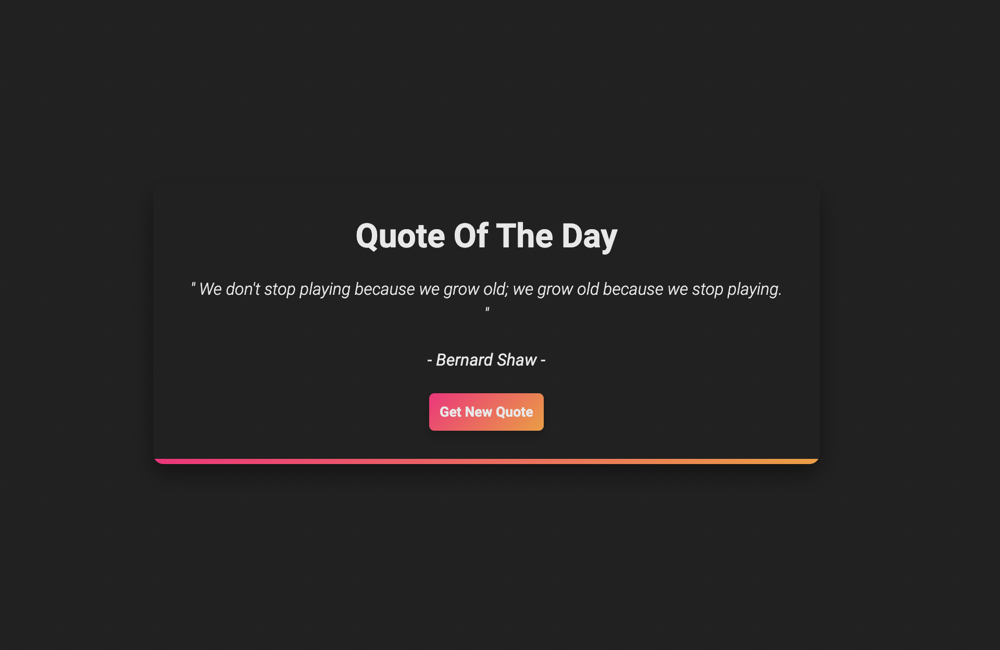

# Random Quote Generator 🗣️
### Description
This project is a simple Random Quote Generator that displays a new, randomly selected quote each time the user interacts with the application. It is designed to provide users with motivational, insightful, or humorous quotes to inspire or entertain them.

### Features 💠
- <b>Random Quotes:</b> The application fetches quotes from a predefined list or an external API and displays them randomly. 
- <b>User Interaction:</b> Users can trigger the display of a new quote, providing an interactive experience. 
- <b>Responsive Design:</b> The application is designed to work seamlessly on various devices, ensuring a consistent user experience.
### Technologies Used ⌨️
1) HTML
2) CSS
3) JavaScript

### Usage
1. Clone the repository:

bash
Copy code
git clone https://github.com/Darthdevv/random-quote-generator.git

2. Open the index.html file in your web browser.

3. Click a button or perform an action to generate a new random quote.

### Screenshots 

### Credits
[@Darthdevv] - GitHub Profile
### License ⚖️
This project is licensed under the MIT License - see the LICENSE file for details.

### Acknowledgments
Special thanks to [quotable.io] for providing the quotes.
